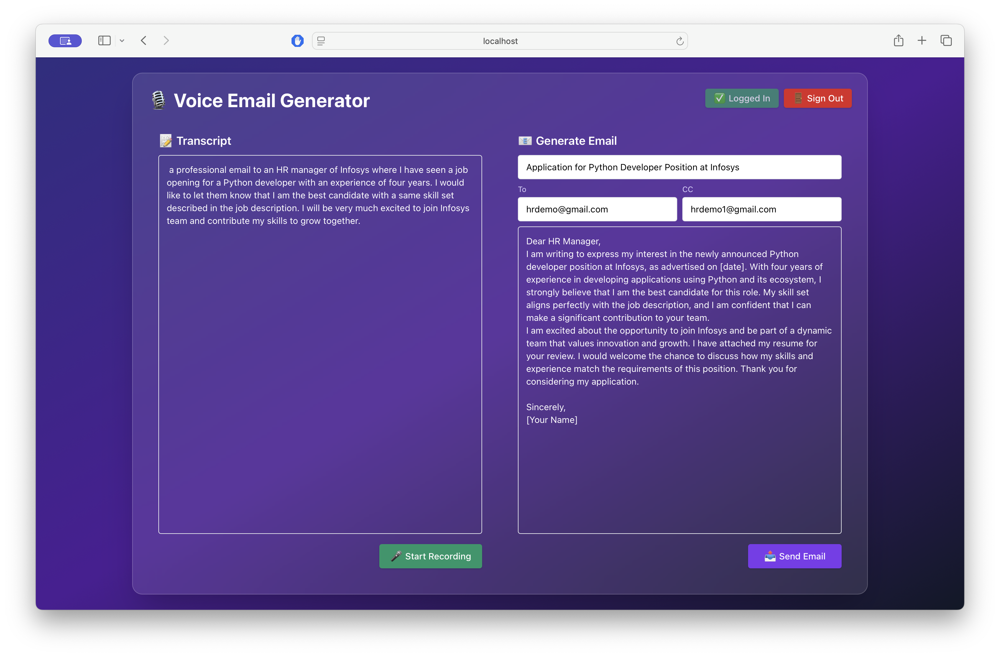
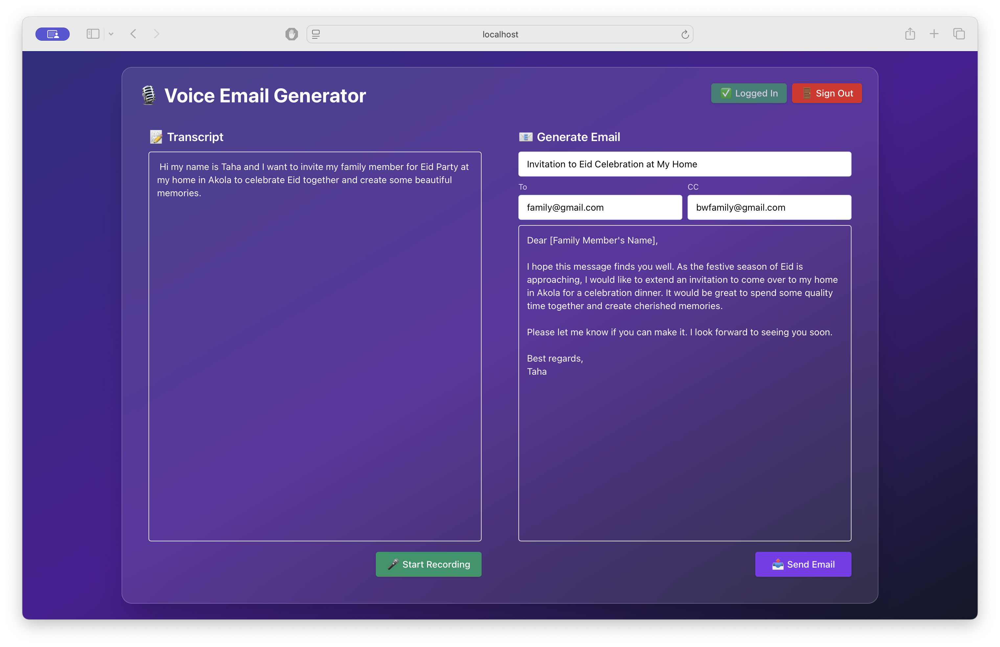

# Voice2Email

This project is a **voice-based email generator** that transcribes audio input, generates email content using AI, and sends emails via the Microsoft Graph API. It consists of a **React frontend** and a **Flask backend**.




---

## Table of Contents

- [Features](#features)
- [Prerequisites](#prerequisites)
- [Setup Instructions](#setup-instructions)
  - [Backend Setup](#backend-setup)
  - [Frontend Setup](#frontend-setup)
- [Running the Project](#running-the-project)
- [Environment Variables](#environment-variables)
  - [Backend](#backend)
  - [Frontend](#frontend)
- [Usage](#usage)
- [Notes](#notes)
- [Project Structure](#project-structure)

---

## Features

- 🎙️ Record audio and transcribe it to text.
- ✉️ Generate structured or general emails using AI.
- 📤 Send emails via Microsoft Graph API.
- 🔐 User authentication with Microsoft OAuth.

---

## Prerequisites

Ensure the following are installed on your system:

- [Node.js](https://nodejs.org/) (v16 or higher)
- [Python](https://www.python.org/) (v3.10 or higher)
- `pip`
- `virtualenv`
- [Git](https://git-scm.com/)

---

## Setup Instructions

### Backend Setup

1. Navigate to the backend directory:

   ```bash
   cd backend
   ```

2. Create a virtual environment:

   ```bash
   python -m venv venv
   ```

3. Activate the virtual environment:

   - On **Windows**:

     ```bash
     venv\Scripts\activate
     ```

   - On **macOS/Linux**:

     ```bash
     source venv/bin/activate
     ```

4. Install the required Python packages:

   ```bash
   pip install -r requirements.txt
   ```

5. Update the `cred.json` file with your Microsoft Azure app credentials:

   ```json
   {
     "client_id": "your-client-id",
     "client_secret": "your-client-secret",
     "tenant_id": "your-tenant-id",
     "redirect_uri": "your-redirect-uri"
   }
   ```

6. Run the backend server:

   ```bash
   python app.py
   ```

   The backend will run on [http://localhost:5001](http://localhost:5001).

---

### Frontend Setup

1. Navigate to the frontend directory:

   ```bash
   cd my-app
   ```

2. Install the required Node.js dependencies:

   ```bash
   npm install
   ```

3. Create a `.env` file in the `my-app` directory with the following content:

   ```env
   VITE_APP_BASE_URL=http://localhost:5001
   ```

4. Start the development server:

   ```bash
   npm run dev
   ```

   The frontend will run on [http://localhost:5173](http://localhost:5173).

---

## Running the Project

To run the entire project:

1. Start the backend server:

   ```bash
   cd backend
   python app.py
   ```

2. Start the frontend server:

   ```bash
   cd my-app
   npm run dev
   ```

3. Open your browser and navigate to [http://localhost:5173](http://localhost:5173).

---

## Environment Variables

### Backend (`cred.json`)

```json
{
  "client_id": "Your Microsoft Azure app client ID",
  "client_secret": "Your Microsoft Azure app client secret",
  "tenant_id": "Your Microsoft Azure tenant ID",
  "redirect_uri": "The redirect URI for your app"
}
```

### Frontend (`.env`)

```env
VITE_APP_BASE_URL=http://localhost:5001
```

---

## Usage

1. **Login**: Click the "Login" button to authenticate with Microsoft.
2. **Record Audio**: Click "Start Recording" to record your voice.
3. **Generate Email**: The app will transcribe the audio and generate an email using AI.
4. **Send Email**: Fill in the recipient details and click "Send Email" to send the email.

---

## Notes

- Ensure your Microsoft Azure app has the `Mail.Send` permission.
- The backend uses the `pywhisper` library for audio transcription and `langchain` for AI-based email generation.
- The frontend is built with **React** and **Vite**, styled using **Tailwind CSS**.

---

## Project Structure

```
voice-email-generator/
├── backend/
│   ├── app.py
│   ├── cred.json
│   ├── requirements.txt
│   └── ...
├── my-app/
│   ├── .env
│   ├── src/
│   ├── public/
│   ├── index.html
│   ├── package.json
│   └── ...
└── README.md
```

---
